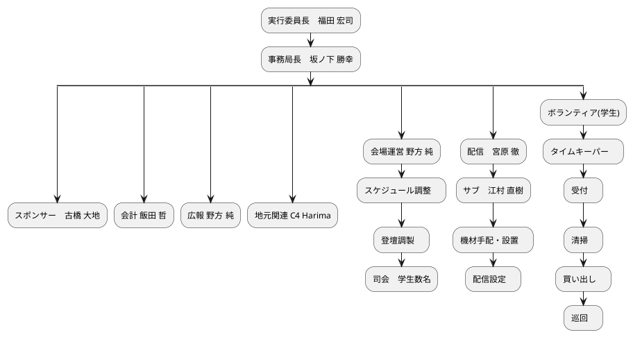

## (参考)事前検討内容

- 8月19日 <https://hackmd.io/WlDCpCzrTJOSYnBPj8U2dQ>
- 8月25日 <https://hackmd.io/@codeforharima/B1QP8C4ys>

## タスク担当者

- 告知
    - Zoomで画面共有を案内。事前リハも案内（宮原さん）
- パンフ
- 登壇マニュアル
- のぽり制作
- 金庫番
- 受付
    - Peatix未登録者への案内（QRコード印刷）
- タイムキーパー
- スポンサー/メディア対応
- 買い出し（消耗品）
- コーヒー
- 委託販売

## Webサイト

- URL
    - <https://stateofthemap.jp/>
    - <https://github.com/osmfj/sotmjp2022>
    - github上の説明を読んでローカル開発&プルリクで更新
    - <https://sotmjp2022.peatix.com/>

## マイルストーン

- 09月15日
    - Webサイト稼働開始（場所と時間だけでも記載したい）
- 10月01日
    - 発表者の募集開始
    - スポンサー発表（以降は追加時に随時発表）
- 10月15日 チケットサイト稼働開始（遅延）
    - 無料&寄付枠（数千円程度）のチケット
    - facebook、osm.jpなどで告知（プレスリリース作りたい）
- 10月31日
    - 発表者の募集終了
- 11月08日
    - 採択結果の発表（申込者へ通知）
- 11月20日
    - パンフレット締め切り、のぼり完成
- 12月03日
    - イベント本番

## 会場情報

- 加古川商工会議所 4階
    - 専有部分：大会議室(A+B)、特別会議室、オーバルルーム
    - 共有部分：ラウンジ、喫煙室は利用可能
    - 大会議室のパーティション分けは行わない
        - 会場後方にパネル展示、フリーコーヒーを用意する
    - 電源消費量の確認
    - 一般来場者に電源貸すか？
        - 基本的には貸さない。個別相談あり（スタッフ部屋など）
- オーバルルームはスタッフ控室として利用
    - 発表数が多い時は5階会議室を借りても良い（まだ借りていない）
- コロナ対策
    - オーバルルーム前に受付を設置し、検温とアルコール消毒を実施
    - 大会議室、特別会議室にもアルコール消毒液を設置
    - Peatixでの登録徹底
- 駐車場
    - 地下に有料駐車場あり。1日最大1500円
    - <http://search.ipos-land.jp/p/detailp.aspx?id=A2810042Z>
- ネットの有線対応
    - 現状復帰が前提で利用可能
    - 天井のWi-Fi機器より有線を下ろすことは可能
    - ケーブルの用意、引き回し施工は、利用者側にて実施
- 1Fにバナー設置可能か確認（福田さん）
    - バナーの数変更の可能性

## 開催テーマ

- テーマ
    - 「リスタート」で決定

## 当日スケジュール

- 09:30～12:30 集合・開錠・準備
- 12:30～13:00 一般入場時間帯
- 13:00～18:00 イベント時間帯
- 18:00～18:10 クロージング(会議室Bに集合、集合写真など)
- 18:10～18:30 交流会準備
- 18:30～20:00 撤収＆交流会(会議室B)
    - 交流会 ≠ 懇親会（お菓子類あり、お酒無し）
    - 他の部屋は順次閉じておく
- 20:00 大会議室を閉じて最終退館

### 部屋割り＆スケジュール

- 会議室A(小さい方の部屋)
    - パネル展示（テープ持ってくる or 買う）
    - 長机・椅子をいくつか設営しておく（コーヒー用は1セット提供）

- 会議室B(大きい方の部屋) / 発表20分+休憩10分
    - 13:00～13:10 オープニング(実行委員長挨拶)
    - 13:10～13:30 基調講演
    - 13:30～13:40 休憩
    - 13:40～14:00 企業:OpenStreetMap x LocationMind（仮）
    - 14:00～14:20 企業:Mapbox
    - 14:20～14:30 休憩
    - 14:30～14:50 マッピングパーティ、100回を超えました！(山下)
    - 14:50～15:00 休憩
    - 15:00～15:20 OpenAerialMap v2 はどうなるか？(古橋)
    - 15:20～15:30 休憩
    - 15:30～15:50 京都府福知山市毛原におけるOSMの制作とQGISを利用した活用(杉原穂紀/幅彩水)
    - 15:50～16:00 休憩
    - 16:00～16:20 CodeForKusatsu＆CodeForGiin(八木)
    - 16:20～16:30 休憩
    - 16:30～16:50 LibreOfficeとコンソール(awk)でのマッピング(丸市)
    - 16:50～17:00 休憩
    - 17:00～17:50 紙地図 VS OSM
    - 17:50～18:00 クロージング（集合写真含む）
    - 18:00～18:10 休憩
    - 18:10～18:30 当日の発表内容のグラフィックレコーディングでのまとめ(安田)
    - 18:30～20:00 交流会

- 特別会議室 / 発表10分 / 当日参加OK(17:10以降)
    - 13:40～14:00 企業:Mapillary?
    - 14:00～14:20 企業:tile.openstreetmap.jpの現状について(Georepublic)
    - 14:20～14:30 休憩
    - 14:30～14:40 企業:iPhoneでマッピンをメモれるApp『マッパーメモ號』(iC株式会社)
    - 14:40～14:50 学部１年生から見た初心者のための Tasking Manager の使い方(古橋研究室１年生チーム)
    - 14:50～15:00 休憩
    - 15:00～15:10 マッピング楽しもう！いろんな視点で(瀧口)
    - 15:10～15:20 『くさつお宝マップ』疑似体験！地域の宝を発見、活用、未来へつなぐ(大塚)
    - 15:20～15:30 休憩
    - 15:30～15:40 OSMFJを使い倒して、加速しよう(三浦)
    - 15:40～15:50 コミュニティマップメーカーのススメ(坂ノ下)
    - 15:50～16:00 休憩
    - 16:00～16:10 オフラインWeb地図サーバー「UNVT Portable」(平澤)
    - 16:10～16:20 Using OSM on Web application first step.(田中)
    - 16:20～16:30 休憩
    - 16:30～16:40 泉州らへんでオープンデータとＧＩＳを楽しむ会の活動報告(くっすん)
    - 16:40～16:50 街の魅力発見とOSM(藤野)
    - 16:50～17:00 休憩
    - 17:00～17:10 YouthMappers AGU Activity Report 2022(柴山)
    - 17:10～18:00 予備

- オーバルルーム
    - スタッフルーム兼配信スタジオ兼控室（関係者）

### 手配機材・消耗品

- レンタル
    - 検温機械 \* 1（ガン型 \* 3 Ikiyaさん）
    - プロジェクターの型番（3台ともLV-WX310ST）確認（福田さん）
- 購入
    - 消毒液 \* 3（誰かが持ってくるのもあり）
        - 受付、大会議室、特別会議室の1台づつ設置
        - Code for Harimaの備品で2つあるので、それを出します。それで足りない分を買い足しはどうでしょう?
    - 個包装のマスク
    - 交流会時のケータリング（Nianticスポンサー）
    - 会場の給湯室の貸し出し不可

## パンフレット

- 記載事項
    - スケジュール
    - スポンサー
    - 諸注意
        - 電源は貸さない
        - 感染対策（マスク必要）

## バナー

- 学生チームで検討中
- 別途チームを作る
- 会場1階の入口遠慮して欲しい。再度お願い中。

## 発表・講演

### 申請内容

- <https://docs.google.com/spreadsheets/d/1gYwVX3ty-mBDIs4R11rzWFOFsn1t6VgF8gsYsz6u8eU/edit?usp=drivesdk>

### スポンサー講演

| 会社名         | 講演有無 | ブース有無 |
| -------------- | -------- | ---------- |
| Niantic        | -        | -          |
| LocationMind   | 有       | 有         |
| Meta&Mapillary | 有       | -          |
| Mapbox         | 有       | -          |
| Georepublic    | 有       | -          |
| iC! Inc        | 有       | -          |
| Geolonia       | -        | -          |

### 通常発表

- 検討事項
    - 募集方法・募集要項
        - 発表申請の評価、採択の判断
    - オンライン配信
        - Zoom＋YouTube Live配信
        - 発表者は発表用PCでZoomに接続し画面共有
        - 配信PCの画面出力をプロジェクターに投影
            - 会場もオンライン参加者も同じ画面を見る
        - 発表者の様子と声はビデオカメラで撮影
        - OSCメンバーにも声をかける（オンライン配信のチェック）
    - 旅費支援
        - 合計26万円の希望。OK
- 採択時の案内（宮原さん）
    - 当日、発表前にオーバルルームでの画面共有テストを行う
    - オーバルルームの有線を使う（USBアダプタ貸し出しも）

### 地図 VS OSM(実行委員企画)

- 検討事項
    - 交通費支給（登壇者全員）…詳細は別途
    - 謝金は無し

### パネル展示

- Shogo Hirasawa
- 災害図上訓練（DIG）での使用例
- OSMを活用した切り絵の地図について
- LocationMind株式会社
- 検討事項
    - もうちょっと色々と貼れそうな気がします。

### フリーコーヒー&委託販売

- 決定事項
    - フリーコーヒーの費用（人件費+材料など） 2万円で調整中
        - 気に入ったコーヒー豆の販売も行ってもらう
        - 水は確認しておく（坂ノ下）
    - 切り絵の地図の委託販売
        - コーヒー屋さんで委託販売をお願い（坂ノ下）

## ボランティア

- 検討事項
    - 学生ボランティアの募集
        - 知り合いの学校へ声掛け。一般募集はしない
        - シフト表作る（坂ノ下）
    - ボランティアのお仕事
        - タイムキーパー
        - 受付（検温、窓口、VIP到着時の担当者到着までの繋ぎ）
        - 清掃（ゴミ拾い、長机などのアルコール消毒）
        - 買い出し（当日急遽必要になったもの、文房具など）
        - 巡回（トラブル検知、担当者への伝達など）
        - 仕事が無い時は発表を視聴する（これが主体でも良い）
        - レポート作成（参加後）
    - 学生ボランティアの謝礼
        - 交通費+薄謝程度（1000円単位の切り上げ）は支払いたい。OK

## ゴミ問題

- 捨てる場所はなし。持ち帰り。
    - 交流会のごみは福田さん持ち帰り。

## 告知方法

- 地元
    - 地元の新聞社、大手新聞社の支局（福田さん）
- プレスリリースだしたい
    - <https://news.mynavi.jp/top/notice/press/>
    - <https://pr-free.jp/pr-free-service/>
    - <https://hatenanews.com/about>
    - 他にも。文書書いてくれる方募集

## 一般参加

### 参加費用

- 参加無料だがPeatix（予定）でチケット申し込みは必要
    - コロナ感染対策で個人情報の入力は必要
- 当日参加（無料）も可能。受付で個人情報の記入は必要
    - 個人情報の記入用紙は事前準備が必要

### 開催支援

- 寄付金額の設定
    - チケット寄付のタイミングはイベント終了後となる
    - 学生登壇者や学生ボランティアへの支払い原資は出来ない
    - 主たる目的
        - 次回以降の予算に回す、赤字時の補填
        - 参加者自らSotMJPを支える文化の醸成
    - 2000円、5000円の2枠
        - Peatixは1件あたり「99円+額面の4.9%」の手数料
        - （参考）額面毎の手取り率（チケット10枚で計算）
       額面    枚数 手数料  手取り   手取り率
       ￥1,000    10 ￥1,480  ￥8,520 85.2%
       ￥2,000    10 ￥1,970 ￥18,030 90.2%
       ￥5,000    10 ￥3,440 ￥46,560 93.1%
        - Peatixからの払い出し時に210円が別途必要

## 収支

### 費用

- 会場費　　 ￥250,000
- 旅費補助　 ￥250,000
- レンタル
- 消耗品
- 交通費

### 収入

- スポンサー ￥800,000
- 寄付　　　 ￥

## 運営体制

※　敬称略

